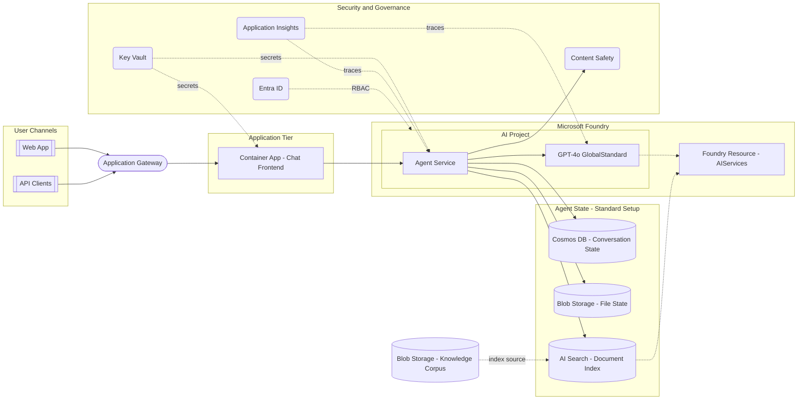
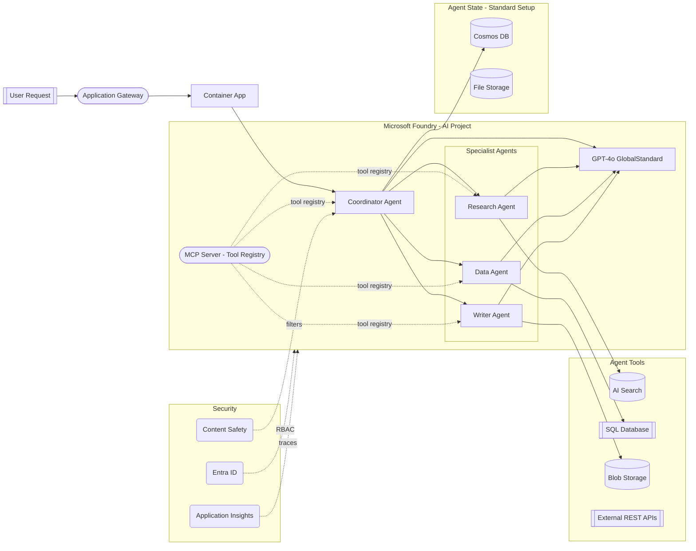
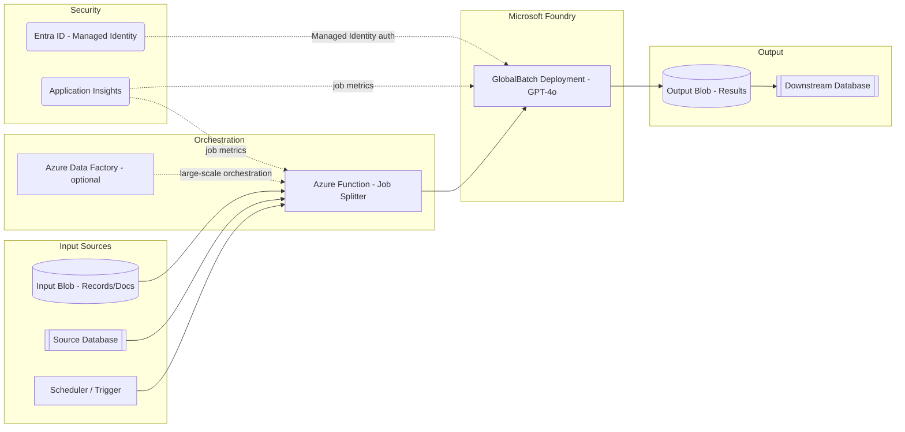
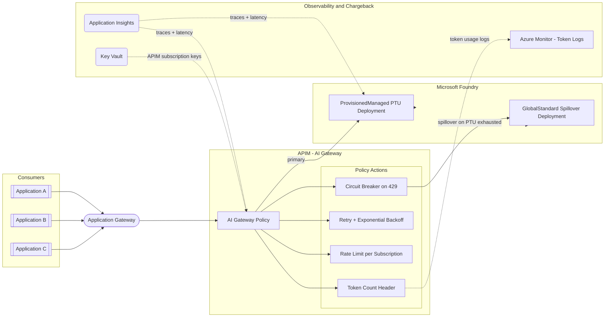
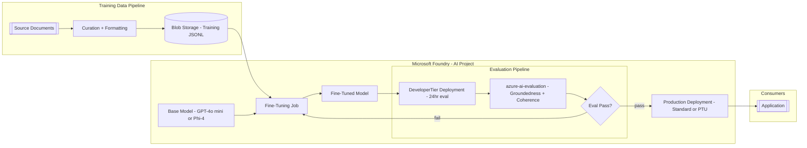
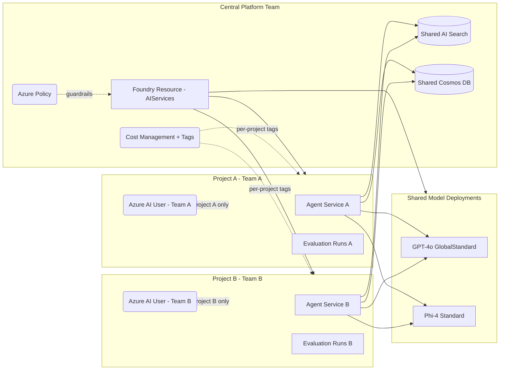
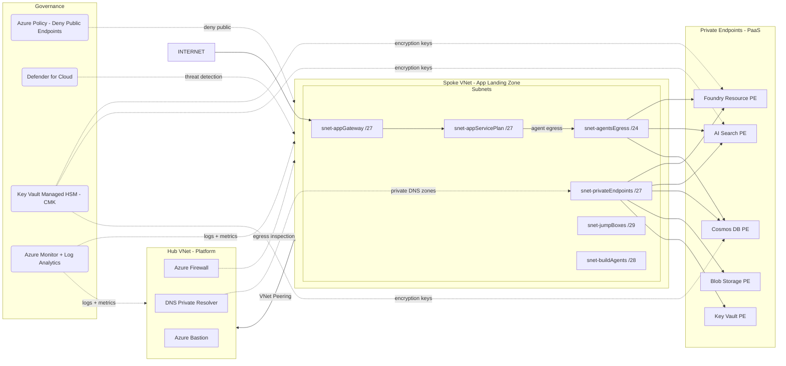

# Microsoft Foundry Architecture Patterns

## Pattern Selection Decision Tree

---

## Pattern 1: Baseline Chat (RAG + Agent Service)

**Use when**: Enterprise chat application grounded on organisational documents. The most common Foundry starting pattern.

**Foundry Components**: App Service or Container Apps, Application Gateway, Foundry Resource, AI Project, GPT-4o GlobalStandard deployment, AI Search (hybrid semantic + BM25), Cosmos DB (agent state), Blob Storage (agent state), Key Vault, Content Safety, Entra ID, Application Insights

**Architecture**:

**Diagram Code**:

| Component | Role | Notes |
|-----------|------|-------|
| Application Gateway | Ingress, WAF | TLS termination, DDoS protection |
| Container App | Chat frontend or API | Hosts application code |
| Foundry Resource (AIServices kind) | Control plane | Hosts projects, deployments, connections |
| AI Project | Development boundary | RBAC isolation, agent runs, evaluations |
| Agent Service | Agentic loop | Tool-calling, conversation management |
| GPT-4o GlobalStandard | Inference | Pay-per-token, any region, highest quota |
| AI Search (hybrid) | RAG retrieval | Semantic + BM25 ranking, vector embeddings |
| Cosmos DB | Agent state | Conversation history, run metadata |
| Blob Storage | File state | Uploaded files, agent scratch space |
| Content Safety | Prompt + response filter | Harmful content, jailbreak detection |
| Key Vault | Secrets management | Connection strings, API keys for data sources |
| Application Insights | Observability | Traces, token usage, latency metrics |

**When to Use**:
- First Foundry deployment - this is the recommended starting pattern
- Enterprise chat with RAG over organisational documents
- Need agent conversation memory and state persistence
- Compliance requires Content Safety filtering

**When NOT to Use**:
- Multiple specialised agents with different tools -> Pattern 2 (MAF)
- No RAG needed and stateless inference -> simpler deployment-only design
- Guaranteed throughput SLA required -> Pattern 4 (PTU Gateway)

---

## Pattern 2: Multi-Agent Orchestration (MAF)

**Use when**: Complex workflows requiring multiple specialised agents, tool-using orchestration, or parallel task execution. Foundry Multi-Agent Framework (MAF).

**Foundry Components**: All of Pattern 1 plus MAF Coordinator Agent, Specialist Agents (2-N), Tool Registry (MCP Server or REST endpoints), Agent-to-Agent communication, optional LangGraph for hosted agent graphs

**Architecture**:

**Diagram Code**:

| Component | Role | Notes |
|-----------|------|-------|
| Coordinator Agent | Orchestrator | Routes tasks to specialist agents, aggregates results |
| Specialist Agents | Domain workers | Each has focused tool set and system prompt |
| MCP Server | Tool registry | Cloud-hosted MCP at mcp.ai.azure.com or custom REST |
| GPT-4o (shared) | Inference for all agents | All agents share deployment; monitor TPM across agents |
| Cosmos DB | Multi-agent state | Shared conversation context, agent run isolation |

**When to Use**:
- Workflows requiring 3+ specialised steps with different tools
- Research + synthesis + action patterns
- Need parallel agent execution for performance
- Existing LangGraph or AutoGen agent code to migrate

**When NOT to Use**:
- Single-turn question-answer with no tools -> Pattern 1 simpler
- No complex routing logic needed -> single agent sufficient

---

## Pattern 3: Batch Inference (GlobalBatch)

**Use when**: Large-scale async document processing, bulk classification, overnight summarisation workloads. 50% cost vs Standard.

**Foundry Components**: Blob Storage (input/output), Azure Function or Logic App orchestrator, GlobalBatch deployment endpoint, optional Azure Data Factory for large orchestration, Application Insights

**Diagram Code**:

| Component | Role | Notes |
|-----------|------|-------|
| GlobalBatch deployment | Async batch inference | 50% cost vs Standard, 24hr max turnaround, JSONL input |
| Azure Function | Job orchestrator | Splits large jobs, polls completion, handles retries |
| Input/Output Blob | Data staging | JSONL format for batch request/response |
| Azure Data Factory | Large-scale orchestration | For jobs with millions of records needing pipeline orchestration |

**When to Use**:
- Nightly document classification, summarisation, or enrichment
- Cost is primary driver and latency is flexible
- Record volumes too large for synchronous API calls

**When NOT to Use**:
- Real-time user-facing responses -> Pattern 1 or Pattern 4
- Need to process records as they arrive -> use async streaming instead

---

## Pattern 4: PTU Gateway (ProvisionedManaged + APIM)

**Use when**: Guaranteed throughput SLA for production workloads. Provisioned Throughput Units (PTUs) prevent the token-rate throttling that affects pay-per-token deployments under load.

**Foundry Components**: APIM with AI Gateway policy, ProvisionedManaged deployment (primary), DataZoneStandard or GlobalStandard deployment (spillover), Application Gateway, Key Vault, Application Insights, Azure Monitor (token chargeback)

**Diagram Code**:

| Component | Role | Notes |
|-----------|------|-------|
| APIM AI Gateway | Intelligent routing | Token counting, rate limiting, retry, circuit breaker |
| ProvisionedManaged (PTU) | Primary inference | Reserved capacity, consistent latency, no throttling under PTU limit |
| GlobalStandard spillover | Overflow inference | Activates when PTU capacity exhausted (429 circuit break) |
| Application Gateway | Ingress | WAF, TLS termination before APIM |
| Key Vault | APIM subscription keys | Stores per-team API keys; APIM fetches on start |
| Azure Monitor + App Insights | Chargeback + SLO | Token usage headers logged per subscription for cost allocation |

**APIM AI Gateway Policy Key Behaviours**:
-  response header populated with prompt + completion tokens
- Per-subscription rate limit: configurable TPM (tokens per minute) ceiling
- Retry: exponential backoff on 429, 500, 503 up to 3 attempts
- Circuit breaker: after N consecutive PTU 429s, route to spillover for 60 seconds

**PTU sizing formula** (approximate):
- PTUs = (peak_RPM * avg_input_tokens + avg_output_tokens) / tokens_per_PTU_per_minute
- GPT-4o: ~2500 TPM per PTU; GPT-4o mini: ~4000 TPM per PTU (verify in capacity calculator)

**When to Use**:
- Production workloads with SLA requiring <500 ms p95 latency
- Multiple teams sharing a single model deployment with chargeback
- Traffic bursts that must not degrade primary application users

**When NOT to Use**:
- Dev/test environments with variable low traffic -> GlobalStandard is cheaper
- Batch overnight processing -> Pattern 3 (GlobalBatch at 50% cost)

---

## Pattern 5: Fine-Tuning + Custom Deployment

**Use when**: Base models underperform on domain-specific tasks (legal, medical, code in proprietary language), or the organisation needs consistent output formatting that prompt engineering cannot reliably achieve.

**Foundry Components**: Blob Storage (training data), Fine-tuning job (Foundry portal or SDK), Base model (GPT-4o mini, Phi-4), DeveloperTier deployment (evaluation only), Production deployment (Standard or ProvisionedManaged), azure-ai-evaluation SDK, Application Insights

**Diagram Code**:

| Component | Role | Notes |
|-----------|------|-------|
| Blob Storage (JSONL) | Training data | chat-completion JSONL format: system, user, assistant message triples |
| Fine-Tuning Job | Model adaptation | Runs in Foundry compute; hyperparameters: epochs, batch size, learning rate |
| Base model | Starting checkpoint | GPT-4o mini (cost-efficient), Phi-4 (open, smaller infra), GPT-4o (highest capability) |
| DeveloperTier deployment | Eval-only | 24-hour lifetime, no SLA, no production traffic; purely for evaluation runs |
| azure-ai-evaluation SDK | Quality gate | Groundedness, coherence, relevance, custom evaluators via code |
| Production deployment | Serving | Standard (pay-per-token) or ProvisionedManaged (PTU) once eval passes |

**Training data quality checklist**:
- Minimum 50-100 examples per task type (more = better generalisation)
- Balanced distribution across all output classes or formats
- System prompt in every example must match production system prompt exactly
- Validation split: hold out 10-20% for automated eval

**Evaluation metrics to gate on**:
- Groundedness >= 4.0/5 (azure-ai-evaluation built-in)
- Coherence >= 4.0/5
- Task-specific custom evaluator (e.g. JSON schema compliance for structured outputs)
- Regression: fine-tuned model must not degrade on general capability benchmark

**When to Use**:
- Domain-specific terminology or format that base model gets wrong consistently
- Structured output (JSON schemas) that prompt engineering cannot enforce reliably
- Cost reduction: smaller fine-tuned model can replace larger base model

**When NOT to Use**:
- Problem is solvable with better prompting or RAG -> fine-tuning is expensive to maintain
- Training data volume < 50 examples -> insufficient signal
- Model version will change frequently -> fine-tune needs rerun on each new base

---

## Pattern 6: Multi-Project Platform (Hub + Projects)

**Use when**: Multiple teams need isolated AI development environments sharing common resources (models, AI Search, storage). Central governance with per-team cost attribution.

**Foundry Components**: Foundry Resource (shared AIServices account), Project A (Team A), Project B (Team B), Shared AI Search, Shared Cosmos DB, per-project RBAC (Azure AI User scoped to project), Azure Policy, Azure Cost Management tags

**Diagram Code**:

| Component | Role | Notes |
|-----------|------|-------|
| Foundry Resource (AIServices) | Shared control plane | One resource hosts all projects; model deployments shared across projects |
| AI Project (per team) | Isolation boundary | RBAC scoped here; agents, evaluations, connections isolated per project |
| Azure AI User role | Team member access | Grants inference + agent run rights without admin access |
| Azure AI Project Manager role | Team lead access | Can create connections, manage deployments within project |
| Shared AI Search | Common knowledge | Cross-project document index; access controlled via Search RBAC |
| Azure Policy | Guardrails | Enforce private endpoints, CMK, approved model list |
| Cost Management tags | Chargeback | Tag resources with team and project for per-team billing reports |

**RBAC layering**:
- Foundry Resource scope:  for platform team only
- Project scope:  for all team members (inference rights)
- Project scope:  for tech leads (connection management)
- Team A cannot see or modify Team B project resources (project RBAC isolation)

**Shared vs isolated resources decision**:
| Resource | Recommendation | Reason |
|----------|---------------|--------|
| Model deployments | Shared (resource-level) | Cost efficiency; quota pooled |
| AI Search index | Separate per team | Data sensitivity; prevent cross-contamination |
| Cosmos DB | Separate per team | Agent state isolation |
| Key Vault | Shared with strict access policies | Operational efficiency |

**When to Use**:
- Organisation with 3+ AI teams who need development isolation
- Central platform team managing shared infrastructure
- Cost chargeback requirement per business unit

**When NOT to Use**:
- Single team -> overhead of multi-project not justified
- Strict data residency requiring separate Foundry resources per team

---

## Pattern 7: Azure OpenAI to Foundry Migration

**Use when**: Organisation has existing Azure OpenAI Service deployments and wants to migrate to Microsoft Foundry to gain Agent Service, evaluation, multi-model access, and unified governance.

**Key driver**: AzureML SDK v1 EOL is June 30 2026. Projects using the old SDK must migrate.

**Diagram Code**:

```mermaid
flowchart LR
  subgraph BEFORE["Before - Azure OpenAI Service"]
    AOAI[Azure OpenAI Resource]
    DEP_OLD[GPT-4o Deployment]
    APIKEY[API Key Auth]
    OLD_SDK[openai Python SDK]
    NO_EVAL[No Evaluation]
    NO_AGENT[No Agent Framework]
  end

  MIGRATE[Migration]

  subgraph AFTER["After - Microsoft Foundry"]
    FND[Foundry Resource - AIServices]
    PRJ[AI Project]
    DEP_NEW[GPT-4o Deployment - same model]
    MI[DefaultAzureCredential - Managed Identity]
    NEW_SDK[azure-ai-projects or openai SDK]
    EVAL_NEW[azure-ai-evaluation]
    AGENT_NEW[Agent Service]
    CS_NEW[Content Safety]
  end

  BEFORE --> MIGRATE --> AFTER
```

**Migration Mapping Table**:

| Before (Azure OpenAI Service) | After (Microsoft Foundry) | Notes |
|-------------------------------|--------------------------|-------|
| Azure OpenAI resource | Foundry resource (AIServices kind) | New resource type; same model availability |
| /openai/deployments/name/... | /api/projects/project/... | New endpoint path format |
| API key (header: api-key) | DefaultAzureCredential (Managed Identity) | Remove all API keys; use MI or workload identity |
| No content filtering policy | Content Safety integration | Enable Content Safety in project connections |
| No evaluation framework | azure-ai-evaluation SDK | Add evaluation runs in CI/CD pipeline |
| No agent framework | Agent Service (basic or standard setup) | Migrate custom agent logic to Agent Service |
| AzureML SDK v1 | azure-ai-projects v1.x or v2.x | v1 EOL Jun 30 2026; migrate urgently |
| openai Python SDK (standalone) | openai SDK (via Foundry endpoint) or azure-ai-projects | Foundry exposes /openai/v1 compatibility endpoint |

**OpenAI SDK compatibility endpoint** (zero code change path):
Old: 
New: 
- Same openai Python SDK, just update  and credential
- Allows incremental migration without refactoring all call sites at once

**Migration phases**:
1. Create Foundry resource + project alongside existing Azure OpenAI resource
2. Point a canary app instance at Foundry using compatibility endpoint
3. Replace API key auth with Managed Identity (update app identity + RBAC)
4. Enable Content Safety in Foundry project
5. Migrate agent logic to Agent Service
6. Add evaluation runs to CI/CD
7. Cut over all traffic; decommission Azure OpenAI resource

**When to Use**:
- Existing Azure OpenAI deployments needing Agent Service, evaluation, or multi-model
- AzureML SDK v1 users (must migrate before Jun 2026)
- Consolidating multiple Azure OpenAI resources under one Foundry platform

**When NOT to Use**:
- Greenfield: start directly with Foundry (Pattern 1) instead
- Azure OpenAI resource in region not yet supported by Foundry -> check region availability

---

## Pattern 8: Enterprise Landing Zone

**Use when**: Full enterprise governance: private networking, CMK encryption, Defender for Cloud, Azure Policy, hub-spoke topology. The most complex pattern; typically required for financial services, healthcare, and government.

**Foundry Components**: All of Pattern 1 + Private Link (privatelink.cognitiveservices.azure.com), hub-spoke VNet, Application Gateway subnet, Agent Egress subnet /24, private endpoints for all PaaS (AI Search, Cosmos DB, Blob, Key Vault), Azure Firewall, DNS Private Resolver, Defender for Cloud, Azure Policy, CMK via Key Vault Managed HSM

**Diagram Code**:

**Subnet Sizing**:

| Subnet | CIDR | IPs | Purpose |
|--------|------|-----|---------|
| snet-appGateway | /27 | 32 | Application Gateway v2 (requires min 26 IPs under load) |
| snet-appServicePlan | /27 | 32 | App Service / Container Apps VNet integration |
| snet-agentsEgress | /24 | 256 | Agent subnet injection - REQUIRED /24 minimum by service |
| snet-privateEndpoints | /27 | 32 | All PaaS private endpoints |
| snet-jumpBoxes | /29 | 8 | Admin jump boxes |
| snet-buildAgents | /28 | 16 | CI/CD build agents |

**Private DNS Zones required**:
-  - Foundry resource
-  - AI Search
-  - Cosmos DB
-  - Blob Storage
-  - Key Vault

**CMK encryption**:
- Key Vault Managed HSM for FIPS 140-2 Level 3 compliance
- Customer-managed keys for Foundry resource, AI Search, Cosmos DB
- Key rotation policy: 90-day automatic rotation recommended

| Component | Role | Notes |
|-----------|------|-------|
| Azure Firewall | Egress inspection | TLS inspection for agent outbound calls |
| DNS Private Resolver | Name resolution | Resolves private DNS zones from on-prem + spoke VNets |
| Azure Bastion | Admin access | Jumpbox access without public IP on VMs |
| Private endpoints | PaaS isolation | All Foundry, Search, Cosmos, Blob, KV traffic stays on VNet |
| Azure Policy | Guardrails | Deny public endpoint creation; enforce private link |
| Defender for Cloud | Threat detection | CSPM + workload protection for PaaS resources |
| CMK via Key Vault HSM | Encryption | Customer controls encryption keys at rest |

**When to Use**:
- Financial services, healthcare, government with strict network isolation requirements
- Compliance frameworks requiring CMK, private endpoints, and audit logging
- Enterprise with existing hub-spoke topology already deployed

**When NOT to Use**:
- SMB or startup -> operational overhead far exceeds benefit
- Proof of concept or hackathon -> use Pattern 1 with public endpoints

---

## Deployment Types Reference

| Deployment Type | Routing | Billing | Latency | Best For |
|-----------------|---------|---------|---------|----------|
| GlobalStandard | Any region | Pay-per-token | Variable | Dev/test, variable prod load |
| GlobalProvisionedManaged | Any region | Reserved PTUs | Consistent | High-throughput real-time |
| GlobalBatch | Any region | 50% of Standard | 24hr max | Overnight bulk processing |
| DataZoneStandard | US or EU zone | Pay-per-token | Variable | Data residency with flexibility |
| DataZoneProvisionedManaged | US or EU zone | Reserved PTUs | Consistent | PTU + data zone compliance |
| DataZoneBatch | US or EU zone | 50% discount | 24hr max | Batch + data residency |
| Standard | Single region | Pay-per-token | Variable | Strict region lock |
| ProvisionedManaged | Single region | Reserved PTUs | Consistent | PTU + strict region |
| DeveloperTier | Single region | Low-cost | No SLA | Fine-tuned model eval only |

**Key decision factors**:
- **Data residency EU requirement** -> DataZone* types (all processing stays in EU)
- **Cost is top priority, latency flexible** -> GlobalBatch (50% savings)
- **SLA / guaranteed throughput** -> ProvisionedManaged or GlobalProvisionedManaged
- **Development / unpredictable traffic** -> GlobalStandard (no commitment)

---

## Pattern Selection Guide

Use this table at the start of an ADS session to narrow to the right pattern:

| Requirement | Recommended Pattern |
|-------------|--------------------|
| Enterprise chat + RAG, first Foundry workload | Pattern 1: Baseline Chat |
| Multi-step workflows, tool-using agents, LangGraph | Pattern 2: Multi-Agent (MAF) |
| Bulk overnight processing, cost-sensitive | Pattern 3: Batch Inference |
| Production SLA, high concurrent users, chargeback | Pattern 4: PTU Gateway |
| Domain-specific formatting, proprietary terminology | Pattern 5: Fine-Tuning |
| Multiple teams, isolated dev, shared governance | Pattern 6: Multi-Project Platform |
| Migrating from Azure OpenAI Service | Pattern 7: AOAI to Foundry Migration |
| FinServ/Health/Gov, private networking, CMK, full compliance | Pattern 8: Enterprise Landing Zone |

**Combining patterns**: Patterns are composable. Common combinations:
- Pattern 1 + Pattern 4: Baseline Chat with PTU Gateway for production SLA
- Pattern 2 + Pattern 8: Multi-Agent on Enterprise Landing Zone
- Pattern 6 + Pattern 4: Multi-Project Platform where each project routes through shared APIM PTU Gateway
- Pattern 7 + Pattern 1: Migration path that ends at Baseline Chat architecture

---

*Last updated: March 2026. Sources: Microsoft Foundry docs, azure-ai-projects SDK v1.0.0 / v2.0.0b4, Azure Architecture Center.*
